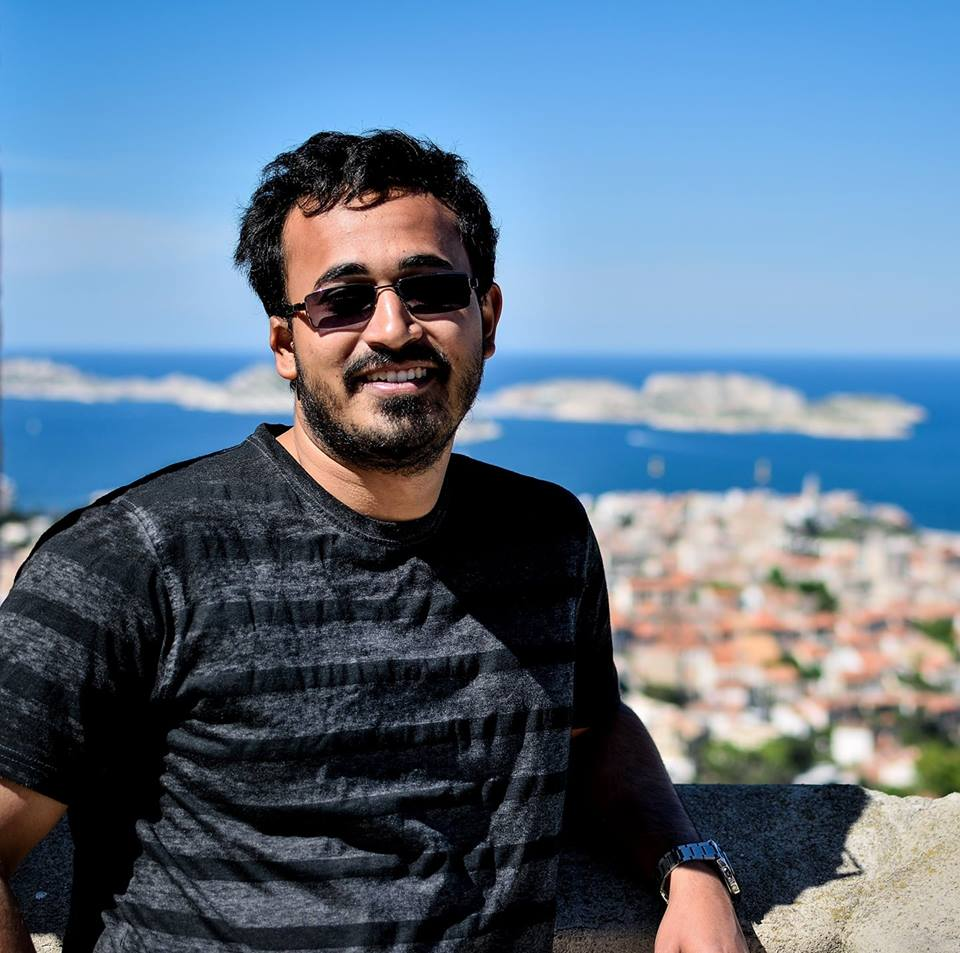

  

    

        <li><a href="https://rudadevsengupta.github.io/assets/cv_rudra.pdf" target="_blank">CV</a></li>
        <li><a href="https://be.linkedin.com/in/rudradev-sengupta-40507917" target="_blank">LinkedIn</a></li>
        

  

<table class="wide">
<tr>
<td class="left">
    
</td>
&nbsp; &nbsp; &nbsp; &nbsp; 
<td class="left">
  I am currently a Ph.D. candidate at the 
  Interuniversity Institute for Biostatistics and statistical Bioinformatics (I-BioStat)
  and am working towards my Ph.D. thesis
  under the  supervision of <a href="https://www.uhasselt.be/fiche?email=ziv.shkedy">Professor Ziv Shkedy</a>.
  My primary field of research is statistical bioinformatics. I am more interested in 
  application of statistical models and currently working on Microbiome data. I am also 
  interested in the computational aspects of statistical models, data science, machine learning techniques and application of statistics
  in sports.
 
  Previously, I studied at the Indian Statistical 
  Institute, where I completed my Bachelor's degree 
  (in 2011), and Master's degree (in 2013) in Statistics. 
  
</td>
</tr>
</table>

<tr>
<td class="left">
  <b> Contact: </b>
  E101, CenStat
  Gebouw D, Agoralaan
  Hasselt University 
  3590 Diepenbeek
  Belgium. 
  Mobile: +32478013794
  Email: <a href="mailto:rudradev.sengupta@uhasselt.be">rudradev.sengupta@uhasselt.be</a>
</td>
</tr>

<!--
For my Master's thesis, I worked on Association Analyses for 

-->
